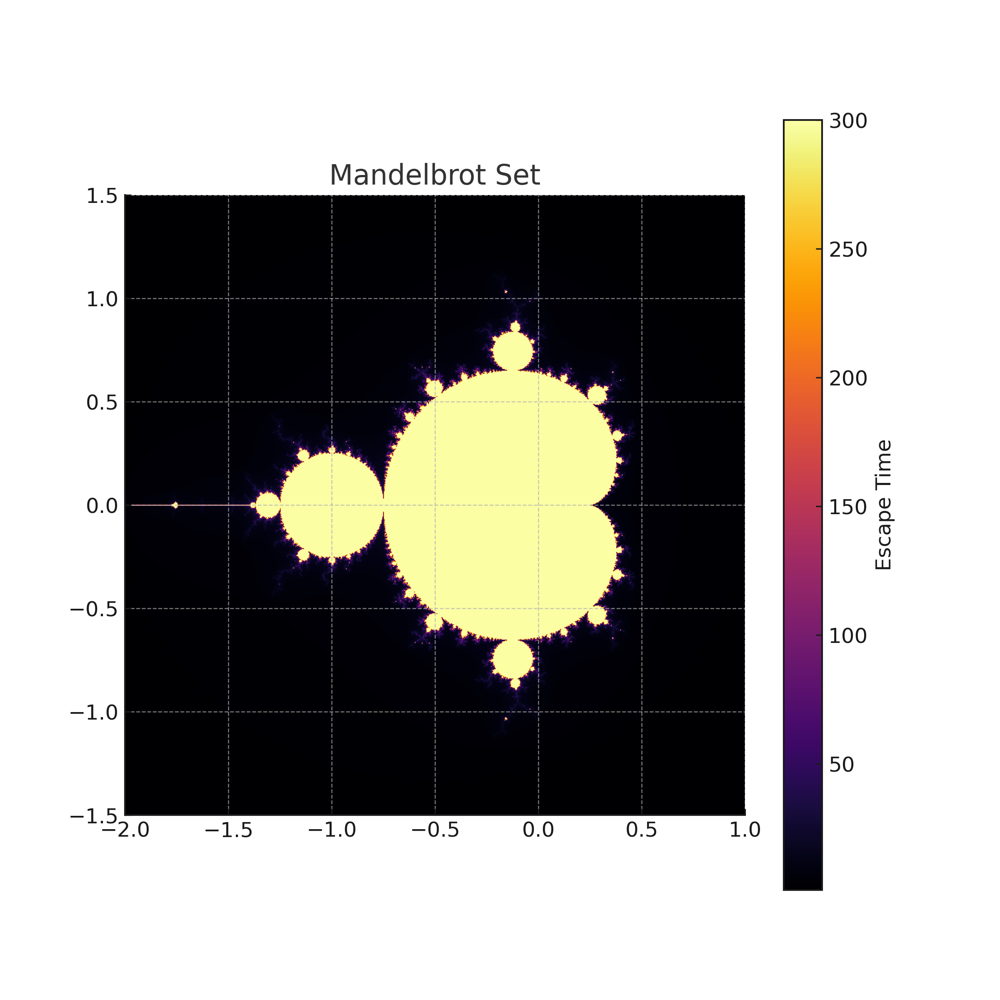
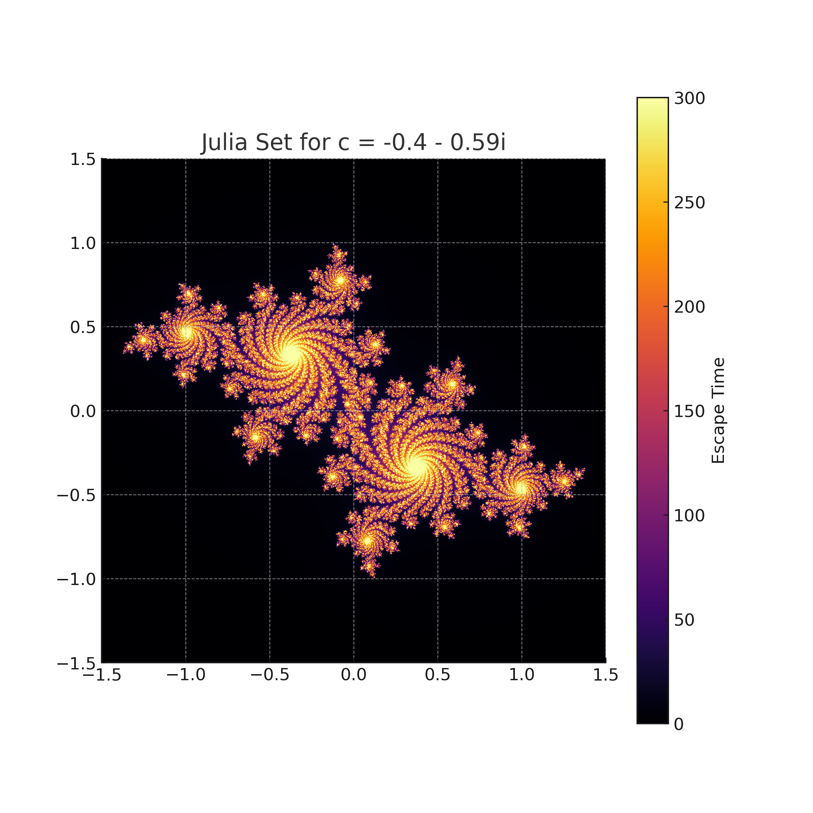
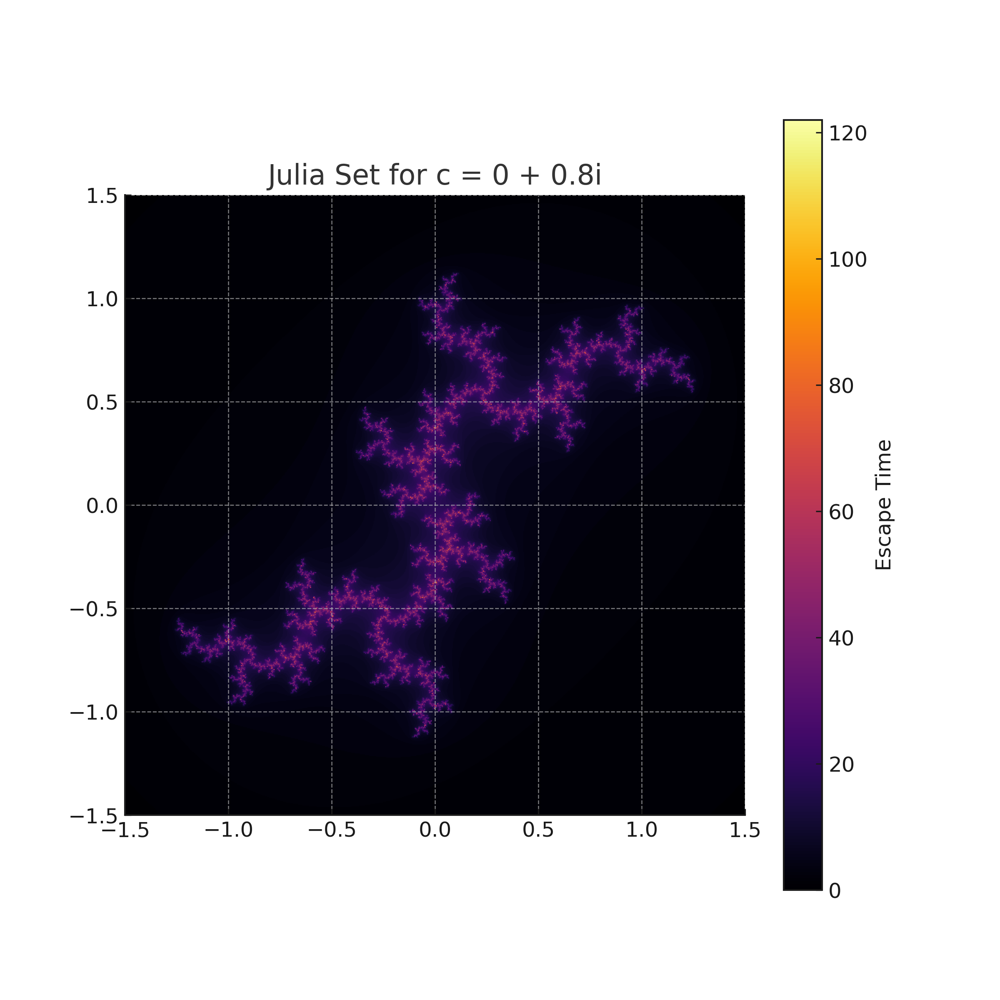

# Julia and Mandelbrot 
This code produces visualisations of the Mandelbrot set and for various Julia sets using the escape time algorithm. Examples of the visualisations produced by the code are below:
 

